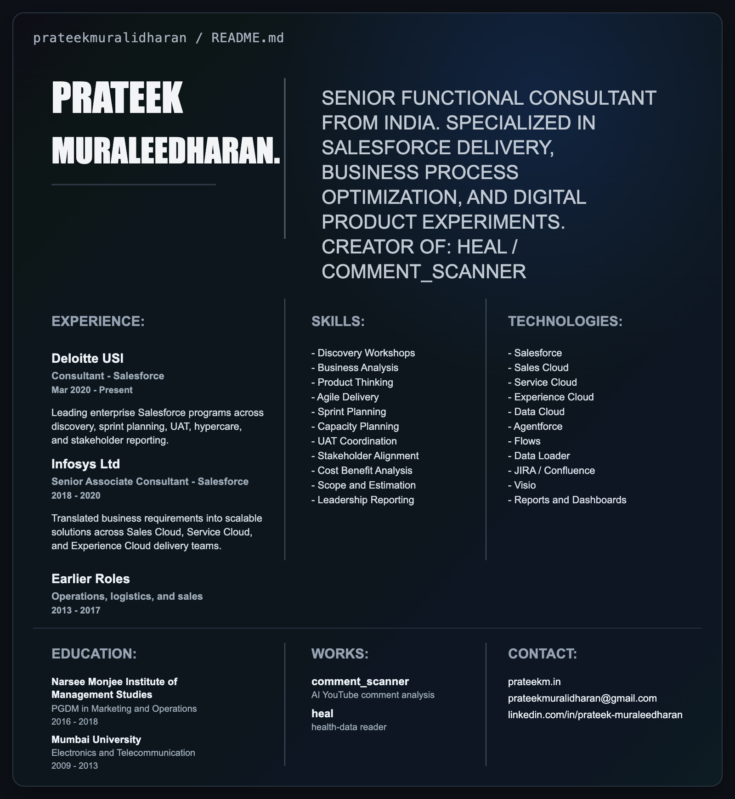

  

  Senior Functional Consultant focused on Salesforce delivery, business process optimization, and small internet products.

  
  
  
  

## Selected Work

- [comment_scanner](https://chromewebstore.google.com/detail/commentscanner-%E2%80%94-youtube/edgdlefoajgenledaijlklcgofpcgcmm) - AI-powered YouTube comment analysis with summaries, themes, sentiment, and reply drafts.
- [heal](https://healapp.co.in) - Health-data reader that turns scattered reports into something structured and understandable.
- [Gayathri Enterprise](https://gayathri-enterprises.co.in) - Brand system and website for a B2B manufacturing business.
- [prateekm.in](https://prateekm.in) - Personal portfolio, reading room, and digital lab.

## Current Focus

- Leading Salesforce programs across discovery, estimation, sprint planning, UAT, hypercare, and stakeholder reporting.
- Building practical AI products and lightweight internet tools alongside enterprise consulting work.
- Exploring better ways to present systems thinking, product judgment, and execution craft online.

  

